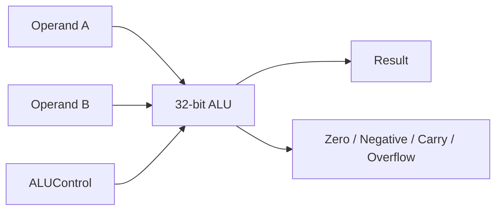

# Subproject 03 - 32-bit Arithmetic and Logic Unit

## Engineering objective

Implement the arithmetic/logic execution block required by the supported RV32I
subset and expose status flags useful for branch decisions and verification.

## Supported operations

| `ALUControl` | Operation | Notes |
|---:|---|---|
| `000` | Addition | Used by ADD/ADDI and address generation |
| `001` | Subtraction | Used by SUB and BEQ equality comparison |
| `010` | Bitwise AND | AND/ANDI |
| `011` | Bitwise OR | OR/ORI |
| `101` | Signed less-than | SLT/SLTI, two's-complement comparison |



## Design decisions

- Addition and subtraction are evaluated on 33 bits to retain carry information.
- Signed overflow is calculated independently from unsigned carry.
- SLT uses `$signed` operands, avoiding errors around sign boundaries.
- Unsupported control codes return zero with cleared arithmetic flags.

## Verification strategy

The directed test set covers normal arithmetic, unsigned carry, signed overflow,
negative results, logical operations, signed comparisons, zero detection, and an
unsupported control code. Every output flag is checked for every vector.

## Files and run

```bash
vsim -c -do run_questa.do
gtkwave alu.vcd
```

- `ALU.v` - synthesizable combinational RTL.
- `ALU_tb.v` - self-checking operation/flag regression.

Expected verdict: `TEST ALU PASSED`.

## Review focus

This block highlights the distinction between arithmetic interpretation and bit
representation: the same 32-bit result can be valid for unsigned arithmetic but
signal overflow for signed arithmetic.

## Verification matrix

| Category | Directed cases |
|---|---|
| Addition | Nominal result, unsigned carry, signed positive overflow |
| Subtraction | Positive result, negative result, signed negative overflow |
| Logic | Independent AND and OR patterns |
| Signed comparison | Negative-versus-positive and false comparison |
| Flags | `Zero`, `Negative`, `Carry`, and `OverFlow` checked on every vector |
| Defensive default | Unsupported control value returns zero with cleared arithmetic flags |

## Integration role

The ALU serves three architectural purposes: arithmetic/logic execution,
effective-address generation for `LW`/`SW`, and equality comparison for `BEQ`
through subtraction and the `Zero` flag.

## Scope boundary

Shifts, unsigned comparisons, multiplication/division, saturation, and exception
reporting are outside the implemented subset. Carry and overflow are exposed for
verification but are not currently consumed by architectural control logic.
